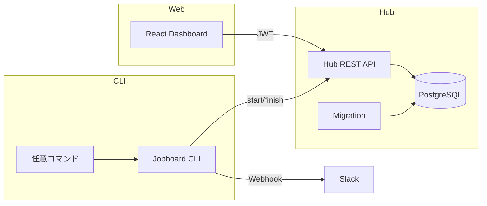
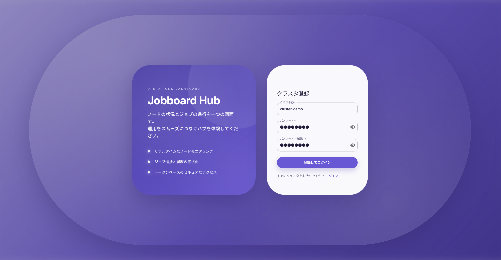
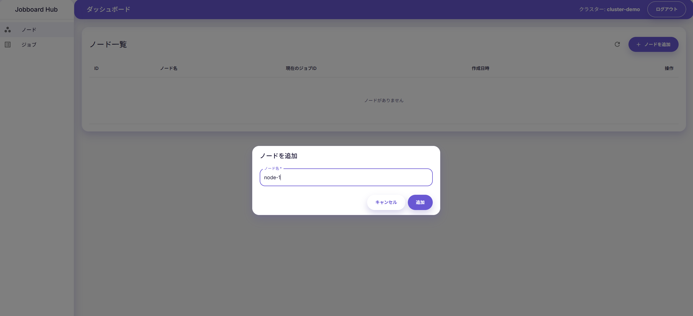
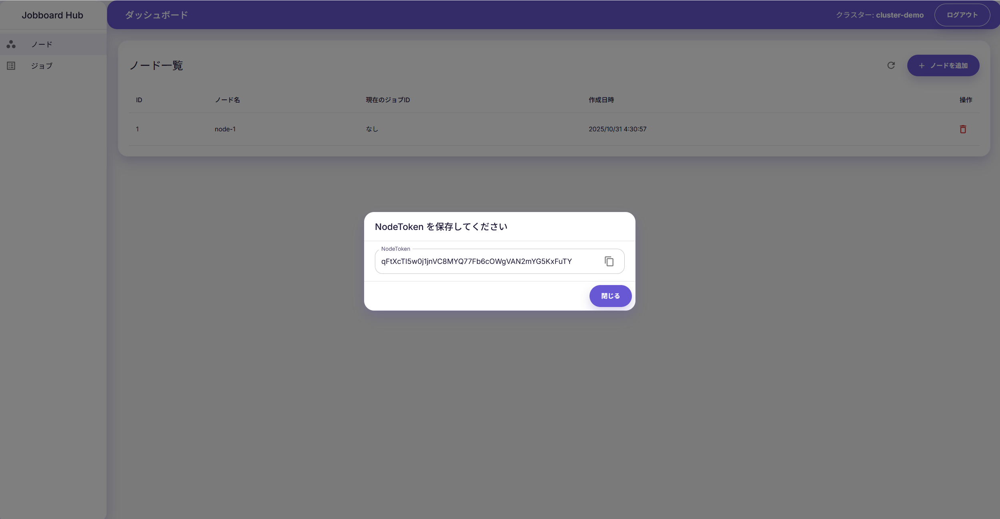
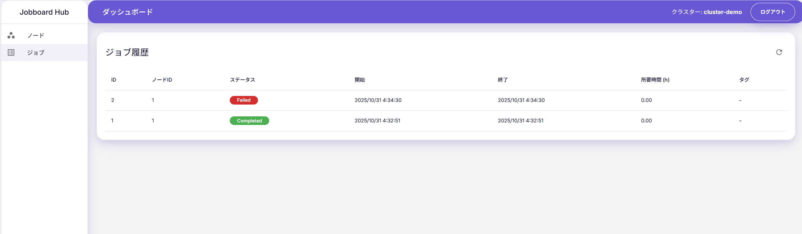
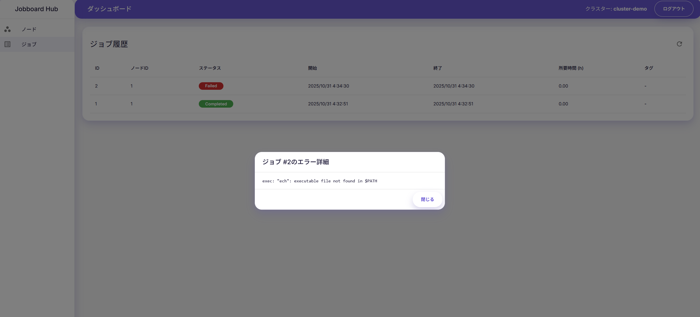
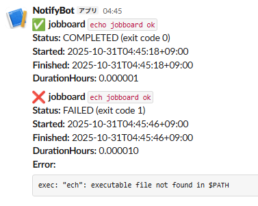

# Jobboard

長時間稼働する機械学習・データ処理ジョブを気軽に監視し、完了時には Slack へ通知できる統合ツールです。Docker Compose ひとつで API / ダッシュボード / CLI をまとめて立ち上げられるので、ポートフォリオとしても程よく「触ってもらえる」体験を提供します。


> **主な特徴**
> - **手軽さ最優先**：`docker compose up --build` で全スタックが起動。  
> - **ジョブ状態の可視化**：開始・終了時刻、 ExitCode、 stderr（失敗時のみ）を保存し、 Slack に結果を通知。  
> - **マルチテナント対応 Hub**：JWT 認証でクラスター／ノード単位のアクセス制御。  
> - **配布しやすい CLI**：ローカルでバイナリを生成でき、本番では GitHub Releases などで配布可能。  

---

## 目次
1. [システム概要](#システム概要)  
2. [アーキテクチャ](#アーキテクチャ)  
3. [クイックスタート](#クイックスタート)  
4. [CLI の使い方](#cli-の使い方)  
5. [Web UI の主な機能](#web-ui-の主な機能)  
6. [データベース設計](#データベース設計)  
7. [環境変数と設定](#環境変数と設定)  

---

## システム概要
| コンポーネント | 役割 |
|---------------|------|
| **Hub (Go / Gin)** | 認証付き REST API。クラスター・ノード管理と PostgreSQL への永続化、ジョブのライフサイクル管理を担当。 |
| **Web (Vite / React / MUI)** | 認証ダッシュボード。ノード管理やジョブ履歴の確認、エラー内容のモーダル表示が可能。 |
| **CLI (Go)** | 任意コマンドを実行しつつ Hub に通知。結果はそのまま Slack に送信。 |
| **PostgreSQL** | クラスター／ノード／ジョブ履歴を保存。 |
| **Slack** | 任意設定。ジョブ成功／失敗をリアルタイムで通知。 |

このリポジトリは「クローンしたらすぐ試せる」を重視しており、デモ用途にも最適です。


---

## アーキテクチャ



### サービス構成（docker-compose）
```
services:
  db     # PostgreSQL 16
  hub    # Gin + Air (開発用ホットリロード) + 自動マイグレーション
  cli    # Go toolchain。起動時に bin/jobboard をビルド
  web    # Vite 開発サーバ (pnpm)
```

Hub コンテナは起動時に `go run ./cmd/migrate --cmd up` を実行し、その後 Air で API サーバを常駐させます。CLI コンテナは `docker compose up` 時に `/app/bin/jobboard` を生成するため、ローカルでそのまま利用可能です。

---

## クイックスタート
### 必要要件
- Docker / Docker Compose v2
- (任意) Node.js 18+（Web を単体起動する場合）

### 1. リポジトリの準備
```bash
git clone https://github.com/yourname/jobboard.git
cd jobboard
cp .env.example .env
cp hub/.env.example hub/.env
cp cli/.env.example cli/.env
```
環境変数は用途に合わせて変更してください（`AUTH_JWT_SECRET` など）。

### 2. 起動
```bash
docker compose up --build
```
順番に PostgreSQL → Hub (マイグレーション含む) → CLI バイナリ生成 → Web が起動します。

### 3. ダッシュボードにアクセス
1. http://localhost:5173 を開く  
2. クラスターを新規登録してログイン  
3. ノード作成 → CLI からジョブ実行 → ジョブ履歴で進捗確認  
4. 失敗ジョブのステータスバッジをクリックするとエラー詳細モーダルが表示されます  

### 4. 使用手順まとめ
1. **クラスターを作成**  
  ログイン画面からクラスター ID とパスワードを登録し、初期ユーザーを用意します。
2. **ノードを作成**  
  ダッシュボードでノードを追加し、発行されるトークンをコピーします。
3. **CLI でジョブを実行**  
  例:  
  ```bash
  # node-token、hub-url、slack-webhook などは .env で設定することも可能（今回は引数で指定）。
  ./cli/bin/jobboard \
    --node-token <発行されたトークン> \
    --hub-url <Hub の URL> \
    --slack-webhook <Slack Webhook> \
    -- echo "jobboard ok"

  ./cli/bin/jobboard \
    --node-token <発行されたトークン> \
    --hub-url <Hub の URL> \
    --slack-webhook <Slack Webhook> \
    -- ech "jobboard ok"   # タイプミスで失敗
  ```
4. **ジョブ結果を確認**  
   テーブルで `ID:1` が成功、`ID:2` が失敗になり、失敗行をクリックするとエラー詳細モーダルで原因を確認できます。
5. **Slack 通知を受け取る**  
   Slack Webhook を設定していれば、成功・失敗がそれぞれ通知されます（例: `assets/image_4.png`）。
<p align="center">
  
</p>

<p align="center">
  
</p>

<p align="center">
  
</p>

<p align="center">
  
</p>

<p align="center">
  
</p>

<p align="center">
  
</p>

---

## CLI の使い方
CLI は実行コマンドの stdout/stderr をそのまま出力しつつ、Hub にステータスを通知、 Slack にサマリを送信します。

```bash
./cli/bin/jobboard \
  --hub-url http://localhost:8080 \
  --node-token <発行されたトークン> \
  --tag nightly \
  -- python scripts/train.py --epochs 50
```

| フラグ | 環境変数 | 初期値 | 説明 |
|--------|----------|--------|------|
| `--hub-url` | `JOBBOARD_HUB_URL` | `http://localhost:8080` | Hub API のベース URL |
| `--node-token` | `JOBBOARD_NODE_TOKEN` | – | ノード認証トークン（必須） |
| `--tag` | – | – | 任意タグ（Slack にも表示） |
| `--slack-webhook` | `JOBBOARD_SLACK_WEBHOOK` | – | Slack Webhook URL |
| `--hub-timeout` | `JOBBOARD_HUB_TIMEOUT` | `60s` | API タイムアウト |
| `--slack-timeout` | `JOBBOARD_SLACK_TIMEOUT` | `10s` | Slack タイムアウト |

### 挙動
- プロセス終了コードをそのまま返却
- 失敗時の stderr を保存・Slack に添付
- Ctrl+C 等で中断した場合も Hub の finish API を呼び出し、ステータスを `failed` に設定（「terminated by signal」メッセージを記録）

---

## Web UI の主な機能
- **ログイン / JWT 認証**  
  クラスター登録・ログイン後、クラスターに紐づくノード／ジョブだけを閲覧。

- **ノード管理**  
  ノード作成時にトークンが発行され、 CLI にコピー可能。テーブルで現在ジョブ ID や作成日時を参照。

- **ジョブ履歴テーブル**  
  ステータスチップで `running / completed / failed` を色分け。失敗時はクリックでモーダル表示 → stderr 等のエラー詳細が確認できる。

- **Slack 通知**  
  Hub 連携の有無に関わらず、 CLI が Slack Webhook を持っていれば成功/失敗のサマリを投稿。

> UI の動きがわかるキャプチャを用意できる場合は `README` に追記してください。

---

## データベース設計
テーブル概要は以下の通りです。

| テーブル | 概要 |
|---------|------|
| `clusters` | クラスター情報（ID / password_hash / created_at）。 |
| `nodes` | クラスターに紐づくノード。トークンはハッシュ化して保存。 |
| `jobs` | ジョブ履歴。開始時刻 / 終了時刻 / ステータス / タグ / duration / error_text を保持。 |

ポイント:
- `jobs.started_at` / `finished_at` は DB では `timestamptz`（UTC）で管理し、 API でレスポンスを返す際に任意タイムゾーンへ変換。
- `jobs.error_text` に CLI 側で取得した stderr やエラーメッセージを保存し、 Web UI で閲覧可能。
- `nodes.current_job_id` により、同一ノードでの二重起動を防止。

---

## 環境変数と設定
### ルート (`.env`)
```dotenv
# DB
POSTGRES_USER=your_user
POSTGRES_PASSWORD=your_password
POSTGRES_DB=jobboard
DB_HOST=db
DB_PORT=5432

# アプリ全体
PORT=8080
AUTH_JWT_SECRET=dev-secret-change-me
AUTH_TOKEN_TTL=15m
TIMEZONE=Asia/Tokyo
```

### Hub (`hub/.env`)
```dotenv
PORT=8080
DB_HOST=db
DB_PORT=5432
DB_USER=postgres
DB_PASSWORD=postgres
DB_NAME=jobboard
AUTH_JWT_SECRET=dev-secret-change-me
AUTH_TOKEN_TTL=15m
TIMEZONE=Asia/Tokyo
```

### CLI (`cli/.env`)
```dotenv
JOBBOARD_HUB_URL=http://localhost:8080
JOBBOARD_NODE_TOKEN=replace-me
JOBBOARD_HUB_TIMEOUT=60s
JOBBOARD_SLACK_WEBHOOK=https://hooks.slack.com/services/... (任意)
JOBBOARD_SLACK_TIMEOUT=10s
TIMEZONE=Asia/Tokyo
```

> Hub/CLI 双方で `TIMEZONE` または `TZ` を指定すると、時刻は自動的にそのロケーションへ変換されます。指定がない場合は `Asia/Tokyo` がデフォルトです。

---

## ライセンス
MIT License

---

Go × React × Slack Integration でサクッとジョブ監視。  
改善案やフィードバックがあればお気軽にどうぞ！
